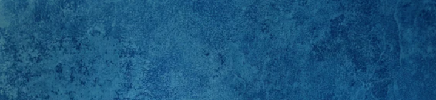
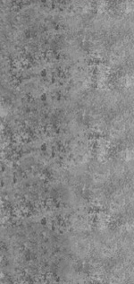
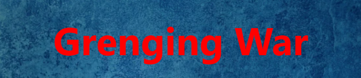
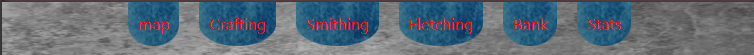
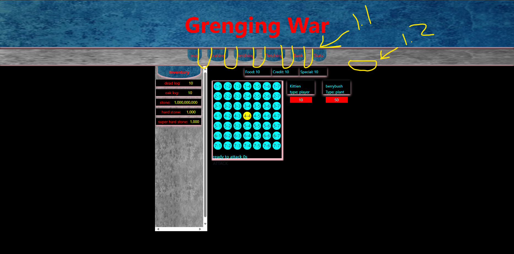
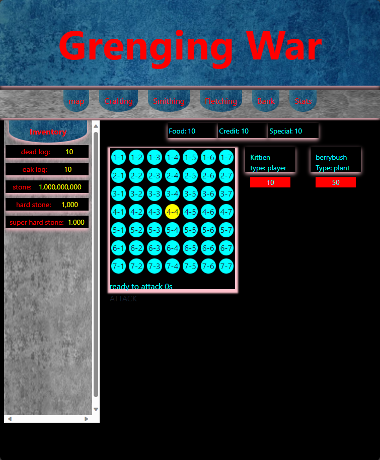

# Designs
## General Information

In my design the goal is for a rustic almost worn out look. As the lore of the game is built around being one of the last humans alive in the world and surviving. I am heading in the direction of a blue tented stone color with also a light gray color stone look for the default colors in the background. images below

 

 

these are the corse of the background designs that I am working with at the current moment. There is still some base work to do with the background design work.

----------------------------------------------------------------

## Logo Design
I am currently in liking the style design and look of this as the logo at the current time.

----------------------------------------------------------------
## Tabs and Buttons
This is my current general design idea for the tabs and buttons.

With further development and decloration to the design of exact tabs that are going to be there will be further refactoring. 

# design
Design is to be like they are banners hanging down. That when clicked will open another menu/page to do said task. 

If it requires there to be a second row of tabs/banners. I want to make then lay in the middle of the gaps that you can see now. Below is a sketch of it.
 
- 1.1 
  - the tabs will lay behind the current ones you can see. 
  - drop down below to make almost like its looking at a angle.
- 1.2
  - the bar there will drop accordingly to the size required

The next part of design that is going to be explained is the width of wich the view sits.
in the image above you can see that it sits in the center. The goal of this design and the perticular widths that I am working with is for you to be able to play this full view on half your screen on a pc. This design should come reletivly close to being able to fit on a mobile view. With out much work being required to make it accessable. Below is a image of what half screen will look like. 
 

----------------------------------------------------------------

### Links to other documentation.
- further documentation on lore 
  - [lore](../lore/lore.md)

